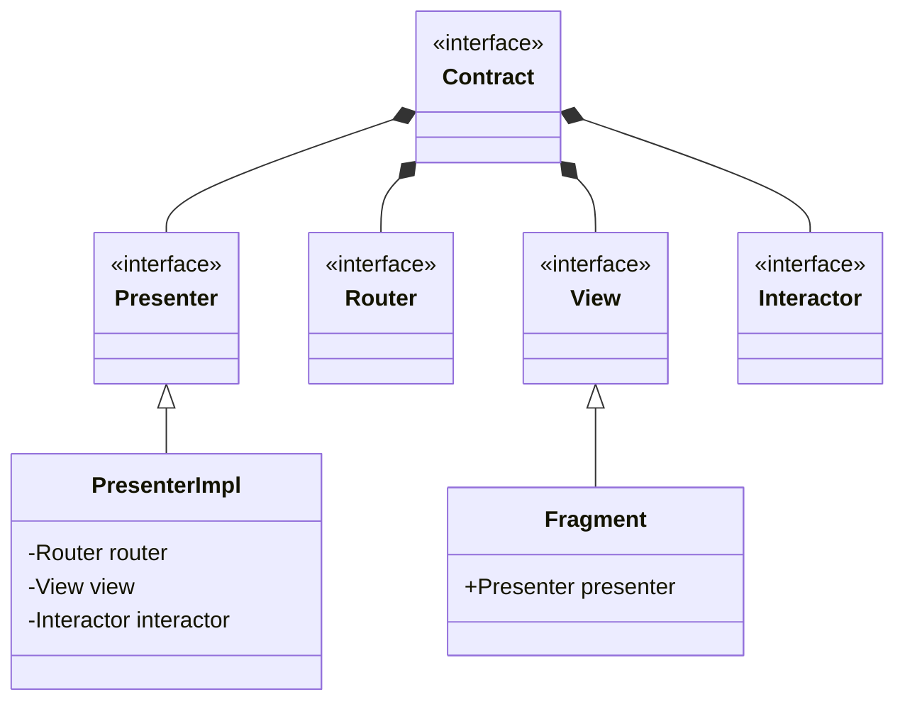

# ViperExample

## Table of Contents
* [About The Project](#about-the-project)
* [Configuration](#configuration)
* [Viper Architecture](#viper-architecture)

## About The Project
This is a simple application with popular movies and movie detail screen utilizes Viper architecture.

## Configuration
To be able to run the application, a TMDB api key should be set as environment variable as ``API_KEY_TMDB = your_api_key``

## Viper Architecture

VIPER stands for View, Interactor, Presenter, Entity, and Router. It is primarily used in IOS development but it can be applied to other platforms as I did in the project. The main idea of this architecture is seperation of concerns as it divides responsibilities into different componens.
#### View
This component configures ui logic and handled by presenter.
#### Interactor
The place where business logics are handled. Data fetching is performed here.
#### Presenter
The component that binds view and interactor.
#### Entity
Data models used in interactor.
#### Router
The component configures and handles vnavigation logic.

### Advantages
#### Modular Structure
Viper’s separated components enable maintaining the project easier. As each component has its own responsibility, making changes without conflicts with other developments are easier.
#### Testability
Separated components enable easier unit testing. Each module can be tested in isolation.
#### Scalability
Modular structure allows easier scaling. Adding new features to existing ones is less error-prone.
#### Fast development
Developers work on their own module. Updating the application becomes simpler.

### Disadvantages
#### Complex structure
Compared to other architectures, Viper has more components. It causes more boilerplate codes and files. It is harder to understant for beginners. This architecture might not used for small projects.
#### Learning curve
For beginners or developers new to Viper, the learning step might be longer. Understanding the interactions between components might take time.
#### Duplication
Viper obligates writing same code again as it requires these components for all screens.
#### Development time
The additional code and structure can lead to longer development times without significant benefits in smaller projects.
