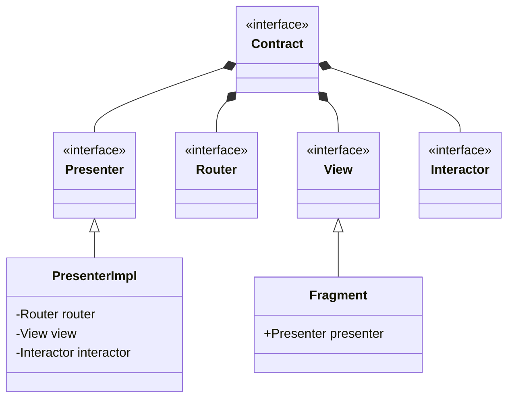

# ViperExample

## Table of Contents
* [About The Project](#about-the-project)
* [Configuration](#configuration)
* [Architecture](#architecture)

## About The Project
This is a simple application with popular movies and movie detail screen utilizes Viper architecture.

## Configuration
To be able to run the application, a TMDB api key should be set as environment variable as ``API_KEY_TMDB = your_api_key``

## Architecture

